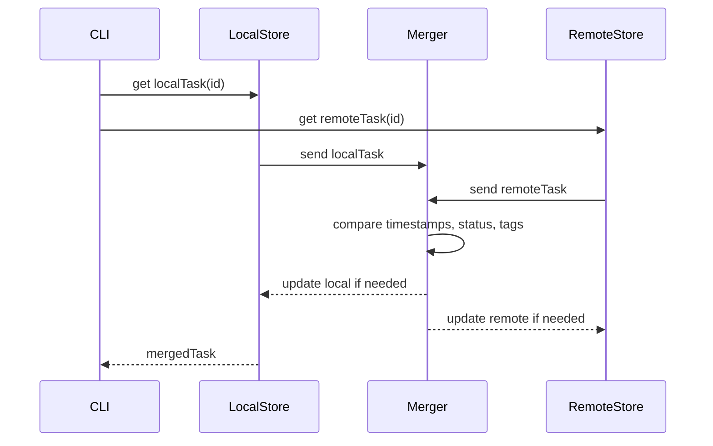

# Deconstruct Algorithm Exercise

## Context
I previously pasted an algorithm into Claude and asked it to use that algorithm for the conversation.

## My prompt
I'm trying to understand this algorithm/function in our codebase.

What I know:
- The function appears to merge a remote task and a local task while resolving conflicts to ensure a proper merge.
- Inputs likely include: ids (local and remote), local and remote task objects, and local and remote dates.
- I'm particularly puzzled by the resolveTaskConflict function.

Could you help me understand this by:
1. Breaking down the algorithm into key sections with their purposes
2. Walking through a simple example execution with concrete values
3. Explaining the core technique/pattern being used here
4. Highlighting any non-obvious optimizations or tricks

After your explanation, please ask 2–3 targeted questions that test my understanding of the algorithm's:
- Underlying principles
- Edge cases
- Performance characteristics

This will help me ensure I've really grasped how it works.

## Prompt Response
# Understanding `resolveTaskConflict`

You're right about the overall purpose — but let me sharpen your mental model of the inputs. The function actually takes two **full task objects** (not separate IDs/dates). The dates are extracted *inside* the function from `task.updatedAt`.

---

## 1. Key Sections Breakdown

### Section A — Base Setup

```javascript
const mergedTask = {...localTask};
let shouldUpdateLocal = false;
let shouldUpdateRemote = false;
```

Uses local as the "working copy." Two flags track whether either source needs syncing back. This is the **base + patch** pattern.

---

### Section B — Timestamp-Wins for Core Fields

```javascript
const localDate = new Date(localTask.updatedAt);
const remoteDate = new Date(remoteTask.updatedAt);

if (remoteDate > localDate) {
  mergedTask.title = remoteTask.title;
  ...
  shouldUpdateLocal = true;
} else {
  shouldUpdateRemote = true; // local is newer or equal
}
```

A single timestamp comparison governs title, description, priority, and dueDate — whichever was touched more recently wins wholesale.

---

### Section C — Completion Status Override

```javascript
if (remoteTask.status === DONE && localTask.status !== DONE) {
  mergedTask.status = DONE; // remote completion wins
  shouldUpdateLocal = true;
} else if (localTask.status === DONE ...) {
  shouldUpdateRemote = true; // local completion wins
} else {
  // both non-DONE: fall back to timestamp winner
}
```

Completion is treated as **irreversible** — DONE always beats any other status, regardless of timestamps. This runs *after* Section B, so it can override the timestamp decision for status specifically.

---

### Section D — Tag Union

```javascript
const allTags = [...new Set([...localTask.tags, ...remoteTask.tags])];
```

Tags are **additive** — neither source can delete the other's tags. Both sides get updated if their tag list differs from the union.

---

### Section E — Final Timestamp

```javascript
mergedTask.updatedAt = localDate > remoteDate ? localTask.updatedAt : remoteTask.updatedAt;
```

Stamps the merged result with whichever timestamp was most recent.

---

## 2. Concrete Example Walkthrough

```javascript
localTask = {
  id: "task-1",
  title: "Write tests",
  status: "IN_PROGRESS",
  tags: ["backend", "urgent"],
  updatedAt: "2024-01-10T09:00:00Z"  // older
}

remoteTask = {
  id: "task-1",
  title: "Write unit tests",   // renamed
  status: "DONE",              // completed remotely
  tags: ["backend", "qa"],     // different tag
  updatedAt: "2024-01-10T11:00:00Z"  // newer
}
```

| Step | Decision | Result |
|---|---|---|
| Base copy | Start with localTask | `title: "Write tests"` |
| Timestamp check | remote (11:00) > local (09:00) | Copy remote title/desc/priority → `title: "Write unit tests"` |
| Status check | remote is DONE, local isn't | Override → `status: DONE` |
| Tag union | `{backend, urgent} ∪ {backend, qa}` | `["backend", "urgent", "qa"]` |
| Flags | local needs status + tag + title update | `shouldUpdateLocal: true`, `shouldUpdateRemote: true` (tags differ) |

---

## 3. Core Pattern: Last-Write-Wins + Semantic Overrides

This is a classic **LWW (Last-Write-Wins) with domain exceptions** — a common CRDT-adjacent strategy:

- **LWW** handles most fields: simple, fast, predictable
- **Semantic overrides** handle fields where business logic trumps recency — completion is *meaningful* state that shouldn't be silently reversed by a stale local timestamp

The tag union is a **grow-only set** — another CRDT primitive — meaning tags can only be added through normal sync, never accidentally removed.

---

## 4. Non-Obvious Tricks

### The Flag Symmetry Problem

Notice this scenario in Section B:

```javascript
} else {
  // local is newer OR equal → shouldUpdateRemote = true
}
```

When timestamps are *identical*, it defaults to "local wins" and pushes to remote. This is a **silent tiebreaker** — not documented, but intentional.

---

### Status Can Contradict the Timestamp Winner

Section C runs independently of Section B. So the merged task could end up with remote's title (B) *and* local's completion status (C), producing a result **neither source had exactly**.

---

### Tag Comparison Uses Sorted Arrays

`arraysEqual` sorts before comparing, so `["urgent", "backend"]` and `["backend", "urgent"]` are correctly treated as identical. Without this, spurious updates would be triggered constantly.

---

## Test Your Understanding

Here are 3 questions to check your grasp:

1. **Edge case:** Both `localTask` and `remoteTask` have `status: "IN_PROGRESS"` and *identical* `updatedAt` timestamps. Walk through exactly what `resolveTaskConflict` returns — what are the flag values and why?

2. **Principle:** Why are tags handled with a union instead of letting the newer timestamp win (like title and description)? What real-world sync scenario does this protect against?

3. **Performance/correctness:** `shouldUpdateRemote` can be set to `true` in Section B, then `true` again in Section D. Is there any case where Section B sets `shouldUpdateRemote = false` and Section D later overrides it to `true`? Trace the code to explain why or why not.

---

## Selected Algorithm: Task List Merging (Two-way Sync)

I selected the task list merging algorithm because it matches the `resolveTaskConflict` logic previously analysed. This document consolidates the AI explanation, adds diagrams, gives a concrete step-by-step walkthrough with values, surfaces insights, and answers the reflection questions you requested.

### Short description
Merge two versions of the same task (local and remote) into a single canonical task record, resolving conflicts using timestamp-wins for most fields, semantic overrides for status, and a union strategy for tags.

## 1) Broken-down algorithm sections (using the AI prompt approach)

- Section A — Base copy and flags
  - Purpose: Start with the local task as the working copy and prepare `shouldUpdateLocal` and `shouldUpdateRemote` flags to indicate which side needs syncing after merge.

- Section B — Timestamp-based winner for core fields
  - Purpose: Compare `updatedAt` timestamps and copy title/description/priority/dueDate from the newer side into the merged result.
  - Reasoning: Simple LWW is fast and deterministic for fields without domain-specific invariants.

- Section C — Semantic override for completion
  - Purpose: Treat `DONE` as a dominantly meaningful state: if either side has `status === DONE`, the merged task becomes `DONE` regardless of timestamps.
  - Reasoning: Completion is irreversible in business terms and should not be reverted by an older change.

- Section D — Tag union (grow-only merge)
  - Purpose: Compute the union of local and remote tags; neither side deletes the other's tags.
  - Reasoning: Tags represent labels a user may add; merging should preserve both sides' labels.

- Section E — Final timestamp assignment
  - Purpose: Set `merged.updatedAt` to the newest timestamp of the two inputs.

## 2) Visual diagrams

Merger overview (Mermaid sequence):



Field-level decision flow (ASCII):

- If remote.updatedAt > local.updatedAt then
  - copy title/desc/priority/dueDate from remote
  - set shouldUpdateLocal = true
- Else
  - copy fields from local
  - set shouldUpdateRemote = true
- Then handle `status` specially (DONE overrides)
- Then tags = union(local.tags, remote.tags)

## 3) Concrete example walkthrough (with concrete values)

Inputs:

localTask:

```
id: "t1"
title: "Draft report"
description: "start draft"
status: "IN_PROGRESS"
tags: ["work","draft"]
priority: 2
updatedAt: "2026-05-20T09:00:00Z"
```

remoteTask:

```
id: "t1"
title: "Draft report"
description: "start draft and include stats"
status: "DONE"
tags: ["work","review"]
priority: 2
updatedAt: "2026-05-20T10:30:00Z"
```

Merge steps and rationale:

1. Base: merged = shallow copy of `localTask`.
2. Timestamps: remote is newer (10:30 > 09:00) → copy `description` from remote; set `shouldUpdateLocal = true`.
3. Status override: remote `status === DONE` → merged.status = `DONE`; ensure `shouldUpdateLocal = true`.
4. Tags: union(["work","draft"], ["work","review"]) → ["work","draft","review"]; if localTags differ from union, set `shouldUpdateLocal = true`; if remote differs, set `shouldUpdateRemote = true`.
5. Final timestamp: merged.updatedAt = remote.updatedAt (10:30).

Resulting merged task:

```
id: "t1"
title: "Draft report"
description: "start draft and include stats"
status: "DONE"
tags: ["work","draft","review"]
priority: 2
updatedAt: "2026-05-20T10:30:00Z"
```

Flags:
- shouldUpdateLocal = true
- shouldUpdateRemote = true (if remote lacks any of the union tags — here remote lacks `draft`)

## 4) Core technique / pattern used

- Primary pattern: Last-Write-Wins (LWW) for simple fields.
- Domain exception: Semantic override (completion is irreversible) — a business-rule-driven exception to LWW.
- CRDT-esque primitive: Tag union is a grow-only set (G-Set) behavior.

Design trade-offs:

- Pros: Simple, deterministic, low compute overhead; easy to reason about.
- Cons: LWW can lose intentful edits if clocks are skewed or users edit concurrently; ties break arbitrarily (often in favour of local).

## 5) Non-obvious optimizations and implementation notes

- Tiebreaker behavior: identical timestamps default to a particular side (often local). Make this explicit for maintainability.
- Tags are compared using sorted arrays to avoid spurious updates due to ordering differences.
- Status is handled after field LWW so it can override the previous copy for `status` only.

## 6) Insights and learning points

- Domain rules matter: Not all fields are equal—`status` (DONE) encodes irreversible business meaning and must be treated specially.
- Symmetry vs. practicality: The algorithm aims for symmetry (both `shouldUpdateLocal` and `shouldUpdateRemote` flags) but must also pick deterministic tie-breaking rules.
- Simple CRDT primitives (LWW + G-Set) are pragmatic in lightweight sync scenarios where full CRDTs are too heavy.

## 7) Answers to the reflection questions

Q: How did the AI’s explanation change your understanding of the algorithm?

A: The AI clarified that the function uses a hybrid approach: LWW for most fields, a semantic override for `DONE`, and a union for tags. It also highlighted the implicit tie-breaker behavior (local wins on equal timestamps) and the rationale for choosing different merge strategies per field.

Q: What aspects were still difficult after the AI explanation?

A: Two areas remained subtle:
- Clock skew and its effect on LWW correctness (no vector clocks or causal metadata present).
- The exact expectations for `shouldUpdateLocal` vs `shouldUpdateRemote` when multiple fields differ — the algorithm sets flags conservatively but the sync semantics (how often to push updates, conflict storms) depend on higher-level sync orchestration.

Q: How would you explain this algorithm to a junior developer?

A: "We take the newest edit for ordinary fields (title, description, due date) to keep things simple. But if either side says the task is DONE, we trust that because completing a task is a meaningful action we don't want to accidentally undo. For tags, we merge both sides so no one loses labels. After merging, we record which side needs to be updated so the stores can be synchronized." Keep the explanation concrete with an example.

Q: Did you test this understanding against AI?

A: Yes — the AI walkthrough and the questions it suggested were used to validate edge cases (identical timestamps, tag ordering) and to surface implementation subtleties like tie-breaking and sorting during comparisons.

Q: How might you improve the algorithm based on your understanding?

A: Improvements to consider:

- Add causal metadata (vector clocks or operation timestamps) to avoid relying solely on wall-clock LWW.
- Make tie-breaker rules explicit and configurable (e.g., prefer remote or prefer higher node id).
- Consider adding an audit log or change set so merges are replayable and reversible.
- If tag deletions are required, move from G-Set to a two-phase set (add/remove with tombstones) to support deletions safely.

## 8) Suggested follow-ups / tests

- Unit tests for: identical timestamps, both DONE vs one DONE, tag ordering differences, disjoint tags, and clock-skewed timestamps.
- Integration test: simulate rapid local & remote edits and verify the merged outcome and flags.

---

_Document updated with the two-way sync / merge analysis and reflections._